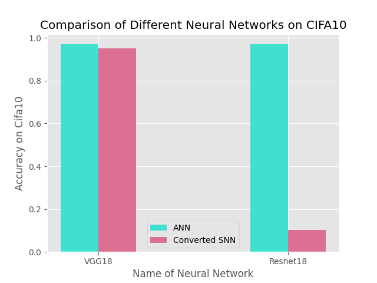
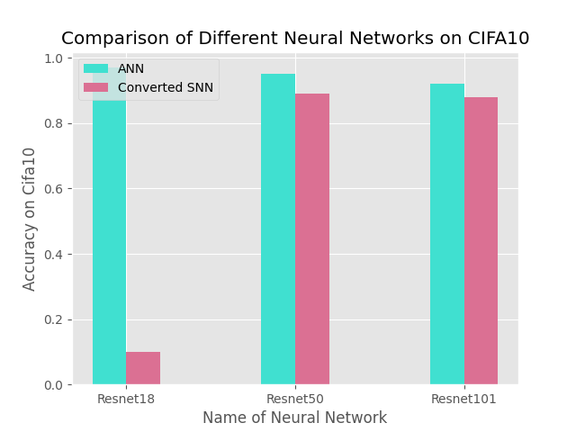
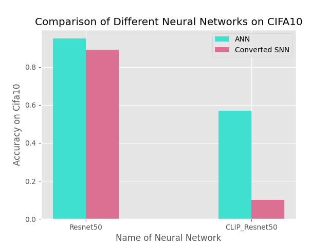

# 系统与计算神经科学大作业

---
## 研究内容及小组分工：

目前SNN的训练难度很大，诸如STDP等生物可解释性方法在无监督上尚且效果不佳，在监督学习中，如何引入监督信号也是一大困难。因此研究人员开始思考能否定制一个与SNN结构相同的ANN结构，使用反向传播算法训练定制好的ANN，然后将得到的权重直接映射到SNN中去。本文参考发表在IJCAI2022上的一篇文章Efficient and Accurate Conversion of Spiking Neural Network with Burst Spikes，把预训练好的ANN中的pooling层和激活层转换为SNN结构，并在此基础上进行了2项研究工作：

1.在深度UNet架构中将SNN用于像素级任务仍然是一个未被探索的领域，实验一将探索将在Lucchi线粒体数据上预训练好的UNet人工神经网络转换为SNN，并进行像素级别的语义分割任务。

2.目前已有不少研究去探究不同的神经元模块对ANN转SNN的精度影响，但对于不同骨干网络及训练方式对ANN转SNN的影响仍未被详细探究过，实验二专注于探究不同的骨干网络（是否有残差连接），不同的预训练方式（是否有监督），骨干网络的大小对于转换的SNN的精度影响。

### 组员：蒋刘赟、卢一卓、邓景天、吴梓佳

### 分工：

1.蒋刘赟和邓景天完成实验一

2.卢一卓和吴梓佳完成实验二，其中吴梓佳负责VGG18、Resnet18、Resnet101的预训练与SNN转化，卢一卓负责Resnet50的预训练与转化、CLIP_Res50的模型提取与转化、实验结果汇总与分析可视化。


 ## 建立虚拟环境
 ```
conda env create -f environment.yaml

conda activate TZJZ
 ```

在建立完虚拟环境后，为了使dataset适配CLIP模型，还需要对./anaconda3/envs/TZJZ/lib/python3.8/site-packages/braincog/datasets 第255行的函数get_cifar10_data进行修改。具体修改方式为：

1.在参数部分添加：CLIP = False

2.把函数中的前两行代码替换为：
 ```
    if CLIP:
        train_datasets, _ = build_dataset(True, 224, 'CIFAR10', root, same_da)
        test_datasets, _ = build_dataset(False, 224, 'CIFAR10', root, same_da)
    else:
        train_datasets, _ = build_dataset(True, 32, 'CIFAR10', root, same_da)
        test_datasets, _ = build_dataset(False, 32, 'CIFAR10', root, same_da)

 ```
## 数据和预训练模型获取

### 实验一

通过下面链接可以获得Lucchi数据集数据，以及训练好的UNet模型。将data文件夹放在/Brain_Cog/目录下，并将Unet.pth移动到/Brain_Cog/UNet_convert_snn/目录下。
> 链接：https://pan.baidu.com/s/1kzzN9ps5sZhxNrnjMPYp3g?pwd=dd9l 
提取码：dd9l


 ### 实验二
通过下面的链接可以获得预训练好的ANN模型。将压缩包解压至本项目的该目录下：preliminary_study_of_convertor/pretrained_models。
> 链接：https://pan.baidu.com/s/1HdmMG4TNWZ7ovlGB-Xjbdw?pwd=io33 
提取码：io33 
 
---

## 实现将UNet的ANN转SNN过程
+ **实现代码在UNet_convert_snn文件夹**
```
cd /home/Brain_Cog/UNet_convert_snn/
```

+ **UNet的转换实现**

关于snn的训练出现了两种主要方法，分别是将人工神经网络转换为snn和直接训练snn。虽然这些方法主要应用于分类任务，但在深度UNet架构中探索snn用于像素级任务仍然是一个未被探索的领域。本实验将探索将UNet人工神经网络转换为snn，并进行像素级别的语义分割任务。

数据集为Lucchi线粒体数据，该数据集的训练集和测试集分别有165张768 &times; 1024的线粒体电镜图像和标注图像，该任务目标是识别出电镜图像中的线粒体。
```
python Unet.py
python Unet_to_snn.py
```

| 模型                | 准确率 (Accuracy) |
| :------------------: | :---------------: |
| UNet_ANN           | 0.8621            |
| UNet_SNN(step=2)   | 0.1035            |
| UNet_SNN(step=4)   | 0.2891           |
| UNet_SNN(step=8)   | 0.3449            |
| UNet_SNN(step=16)  | 0.4572            |
| UNet_SNN(step=32)  | 0.5919            |
| UNet_SNN(step=64)  | 0.7038            |
| UNet_SNN(step=128)  | 0.7789            |
| UNet_SNN(step=256)   | 0.8232            |

我们对线粒体预测结果进行二值化（即0和1），然后再计算相应的准确率、Jaccard相似度和F1分数。结果如下表展示。
```
python evaluate.py
```
| 模型 |  准确率    | Jaccard 相似度 | F1 分数 |
| :----------: |:-------:| :------------: | :-------------: |
| ANN  | 0.9855  | 0.7963          | 0.8866   |
| SNN  | 0.9852  | 0.7950          | 0.8859   |

我们还可将结果转换为二值图像，并进行可视化。
```
python binaryzation.py
```
以下依次展示，原始图像、标签图像、ANN_UNet预测图像和SNN_UNet预测图像。


---

## 探究骨干网络不同因素对ANN转SNN精度的影响

该研究选择了不同规模、不同架构、不同训练方式的神经网络在CIFA10数据集上进行了ANN的预训练（CLIP除外），并将其转化为SNN，对比他们在CIFA10测试集上的分类准确率。希望该分析结果可以对日后的ANN转SNN工作带来一些启发。

### 不同网络架构对ANN转SNN精度的影响

```
cd preliminary_study_of_convertor/Cifa10/VGG18
python CIFAR10_VGG18.py
python converted_VGG18.py
```

```
cd preliminary_study_of_convertor/Cifa10/Resnet18
python CIFA10_Renet18.py
python converted_Resnet18.py
```

该实验对比了预训练好的VGG18和Resnet18被转成SNN后的分类准确率，其中该VGG18和Resnet18相比，除了没有残差连接外，其他模块均完全相同。



从上图可以看出当网络中存在残差连接时，直接将pooling层和relu激活层转化成SNN结构会带来较大的精度损失。

### 不同网络大小对ANN转SNN精度的影响

```
cd preliminary_study_of_convertor/Cifa10/Resnet18
python CIFA10_Renet18.py
python converted_Resnet18.py
```

```
cd preliminary_study_of_convertor/Cifa10/Resnet50
python CIFA10_Renet50.py
python converted_Resnet50.py
```

```
cd preliminary_study_of_convertor/Cifa10/Resnet101
python CIFA10_Renet101.py
python converted_Resnet101.py
```

该实验对比了预训练好的Resnet18、Resnet50、Resnet101被转成SNN后的分类准确率。



从上图可以看出，当Resnet模型的参数量逐渐增加，被转成SNN后的精度损失会逐渐减少。

### 不同网络预训练方式对ANN转SNN精度的影响

```
cd preliminary_study_of_convertor/Cifa10/Resnet50
python CIFA10_Renet50.py
python converted_Resnet50.py
```

```
cd preliminary_study_of_convertor/Cifa10/CLIP_Res50
python convert_a_CLIP.py
```

该实验对比了预训练好的Resnet50、CLIP_Res50被转成SNN后的分类准确率。其中CLIP_Res50直接调用了官方预训练参数，Resnet50在CIFA10上进行了预训练。



从上图中可以看出，对于同样的模型架构，使用有监督训练得到的ANN转成SNN后精度损失要比自监督训练的要少。

### 局限性
1.受时间和计算资源限制，本实验中对比的模型数量较少，使用的数据集（CIFA10）太小，得到的分析结果的适用范围较小

2.CLIP模型是在分辨率为224*224的图文数据集上训练的，当把该模型直接迁移到分辨率为64 *64的CIFA10数据集时，模型能力难以直接泛化过去。

3.CLIP模型使用了4亿个图像-文本对数据进行训练，而受时间和计算资源限制，本实验中跟其对比的Resnet50模型仅在CIFA10上训练，模型能力差距过大。


