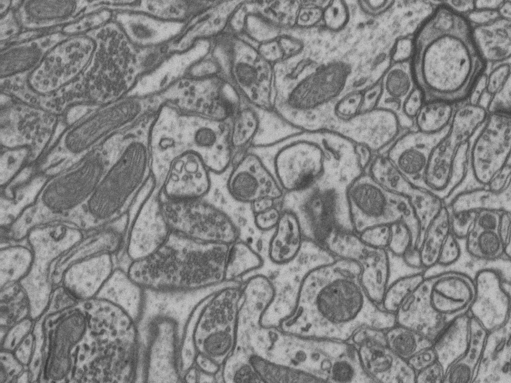
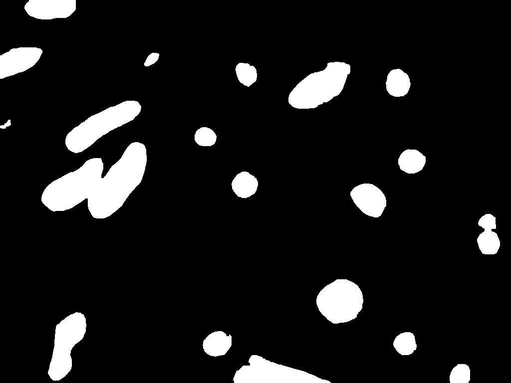
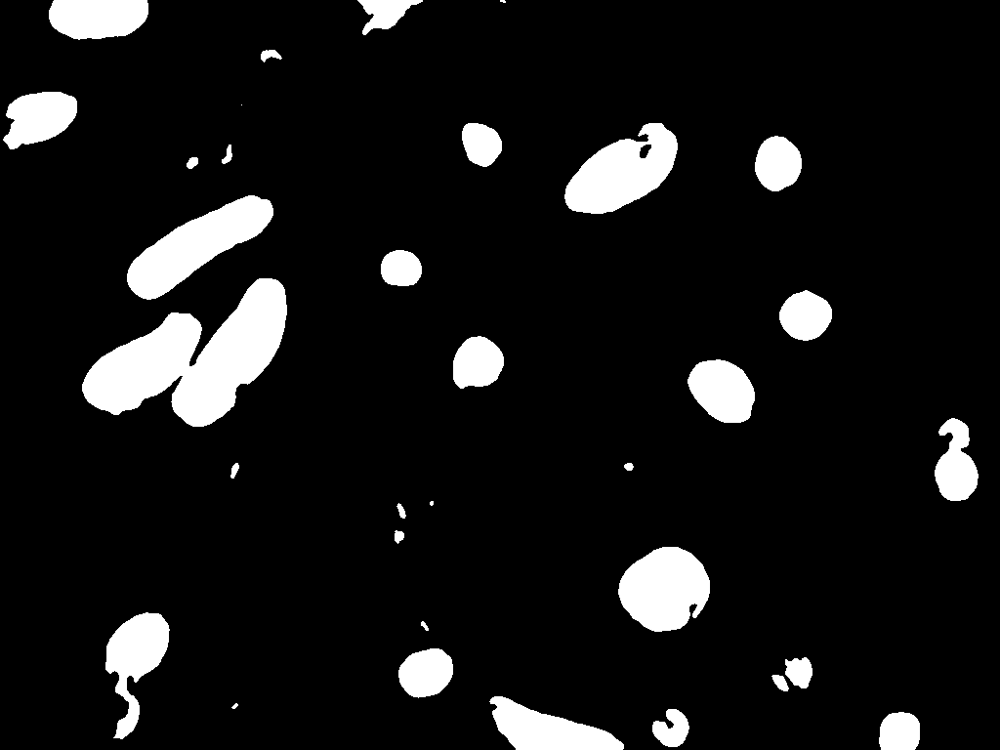

# 系统与计算神经科学大作业

---

组员：蒋刘赟、卢一卓、邓景天、吴梓佳

分工：

...略 后期补充
 **建立虚拟环境**
运行conda env create -f environment.yaml

conda activate
 
 **数据和预训练模型获取**

通过下面链接可以获得Lucchi数据集数据，以及训练好的UNet模型。将data文件夹放在/Brain_Cog/目录下，并将Unet.pth移动到/Brain_Cog/UNet_convert_snn/目录下。
> 链接：https://pan.baidu.com/s/1kzzN9ps5sZhxNrnjMPYp3g?pwd=dd9l 
提取码：dd9l
---

## 实现将UNet的ANN转SNN过程
+ **实现代码在UNet_convert_snn文件夹**
```
cd /home/Brain_Cog/UNet_convert_snn/
```

+ **UNet的转换实现**

关于snn的训练出现了两种主要方法，分别是将人工神经网络转换为snn和直接训练snn。虽然这些方法主要应用于分类任务，但在深度UNet架构中探索snn用于像素级任务仍然是一个未被探索的领域。本实验将探索将UNet人工神经网络转换为snn，并进行像素级别的语义分割任务。

数据集为Lucchi线粒体数据，该数据集的训练集和测试集分别有165张768 &times; 1024的线粒体电镜图像和标注图像，该任务目标是识别出电镜图像中的线粒体。
```
python Unet.py
python Unet_to_snn.py
```

| 模型                | 准确率 (Accuracy) |
| :------------------: | :---------------: |
| UNet_ANN           | 0.8621            |
| UNet_SNN(step=2)   | 0.1035            |
| UNet_SNN(step=4)   | 0.2891           |
| UNet_SNN(step=8)   | 0.3449            |
| UNet_SNN(step=16)  | 0.4572            |
| UNet_SNN(step=32)  | 0.5919            |
| UNet_SNN(step=64)  | 0.7038            |
| UNet_SNN(step=128)  | 0.7789            |
| UNet_SNN(step=256)   | 0.8232            |

我们对线粒体预测结果进行二值化（即0和1），然后再计算相应的准确率、Jaccard相似度和F1分数。结果如下表展示。
```
python evaluate.py
```
| 模型 |  准确率    | Jaccard 相似度 | F1 分数 |
| :----------: |:-------:| :------------: | :-------------: |
| ANN  | 0.9855  | 0.7963          | 0.8866   |
| SNN  | 0.9852  | 0.7950          | 0.8859   |

我们还可将结果转换为二值图像，并进行可视化。
```
python binaryzation.py
```
以下依次展示，原始图像、标签图像、ANN_UNet预测图像和SNN_UNet预测图像。






---


